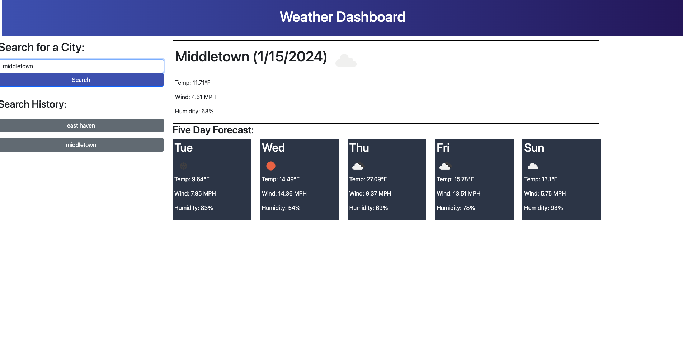

# Weather Dashboard

## Description

A weather dashboard web application that provides real-time and 5-day forecast weather data for multiple cities. Users can search for cities, view current weather conditions, and store their search history.

## Features

- **Search Functionality:** Users can search for cities to view current and future weather conditions.
- **Weather Details:** Displays city name, date, weather icon, temperature, humidity, and wind speed.
- **5-Day Forecast:** Provides a 5-day forecast with date, weather icon, temperature, wind speed, and humidity.
- **Search History:** Stores a history of searched cities using `localStorage`.

## Screenshots

## Deployment

- [Live Demo](#) (https://weatherwebbapp.netlify.app/)
- [GitHub Repository](#) (insert your GitHub repository URL here)

## Technologies Used

- HTML
- CSS
- JavaScript
- OpenWeather API

## Installation

1. Clone the repository.
2. Open the `index.html` file in your browser.

## Usage

1. Enter a city name in the search bar.
2. View current and future weather conditions.
3. Check the 5-day forecast.
4. Review search history.

## Credits

- OpenWeather API

## License

This project is licensed under the [MIT License](LICENSE).
