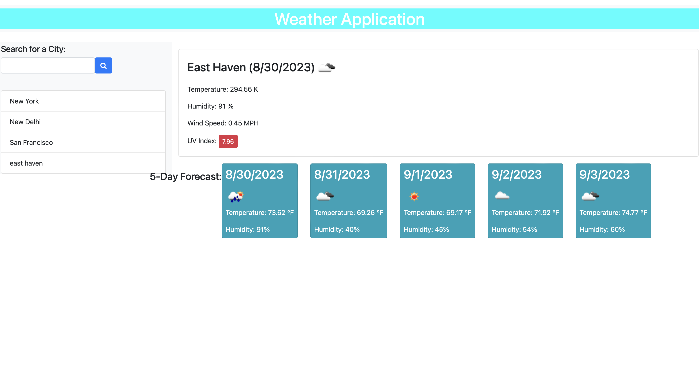

# Weather Dashboard

## Description

The Weather Dashboard is a web-based application that provides users with current and future weather conditions for a specified city. Users can search for cities and receive detailed weather information, including temperature, humidity, wind speed, and more. Additionally, the application maintains a search history for easy access to previously searched cities.

## Features

- Search for a city to retrieve current and future weather conditions.
- Display city name, date, weather conditions icon, temperature, humidity, and wind speed for the current weather.
- Provide a 5-day forecast with date, weather conditions icon, temperature, wind speed, and humidity.
- Maintain a search history for quick access to previous city searches.
- Intuitive user interface for smooth navigation.

## Usage

1. Enter the name of a city in the search input field.
2. Click the "Search" button to retrieve weather information for the specified city.
3. View the current weather conditions and the 5-day forecast for the selected city.
4. Previously searched cities are displayed in the search history section. Click on a city in the history to see its weather information again.

## Installation

1. Clone the repository: `git clone `
2. Navigate to the project folder: `cd weather-dashboard`
3. Open the `index.html` file in a web browser.

## Credits

- Weather data provided by [OpenWeatherMap](https://openweathermap.org/)

## Weather application
- [live site]()
- [Github repo]()
